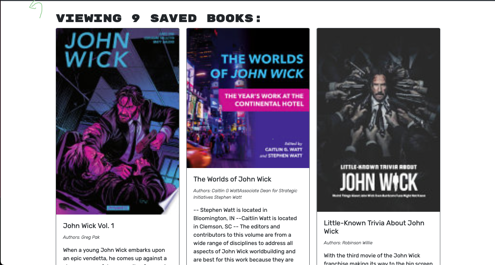
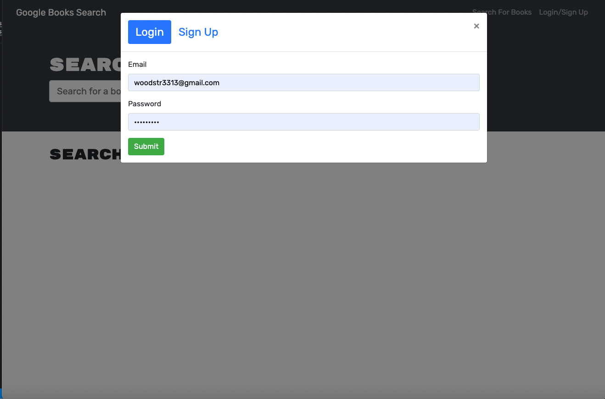
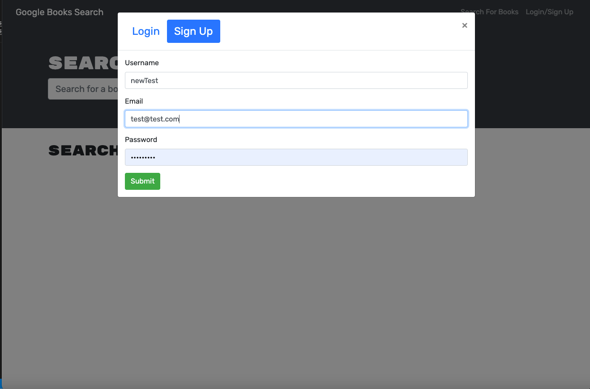

# 21 MERN: Book Search Engine

## Description
  This MERN Stack application allows users to search for books. Users are able to create a new account or sign into an existing account and start searching for books. Once the user finds the book or books that they are looking for the user can then save those books. The user can view saved books and or remove saved books if they no longer want to see them. 

## Table of Contents 

- [Usage](#usage)
- [Contributing](#repo)
- [Credits](#credits)
- [Tests](#test)

## Usage
  [Deployed Link](https://book-search-engine-gatech.herokuapp.com/)

  

  

  

  

  Walkthrough Video: https://drive.google.com/file/d/1QXEoU4CRbZ5LiN0CfWSfFZ4_BC9tlUx1/view
  

## Credits

[My GitHub: woodstr3313](https://github.com/woodstr3313)

[My E-commerce GitHub](https://github.com/woodstr3313/Book-Search-Engine)

[My email: woodstr3313@gmail.com](email:woodstr3313@gmail.com)

## How to Contribute
  Please contact me at woodstr3313@gmail.com if you would like to contribute.

## Tests
  Currently no tests

